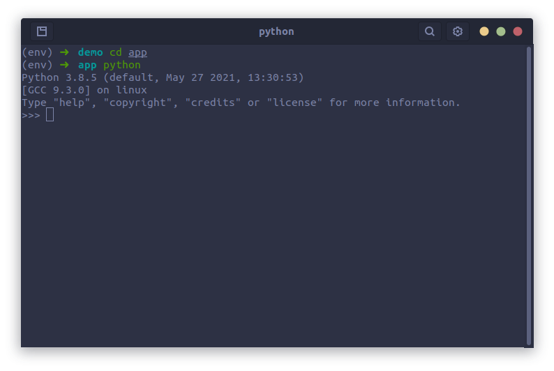
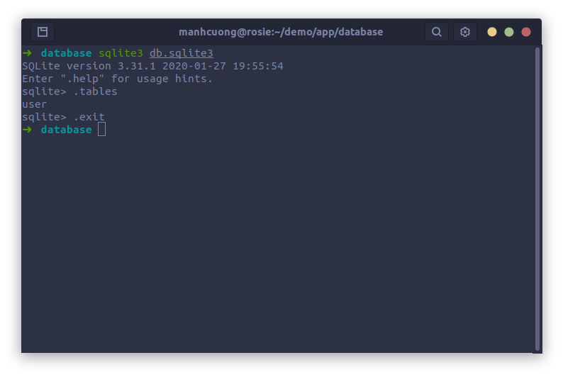

* **Bước 1**: Cài đặt `sqlite3`
  * Để có thể chạy được chương trình, trước tiên cần cài đặt `sqlite3`, thực hiện các lệnh dưới đây:
    ```
    sudo apt-get update
    sudo apt-get install sqlite3
    sqlite3 --version # kiểm tra
    ```

* **Bước 2**: Thiệt lập môi trường:
  * Thực hiện các lệnh sau:
    ```
    cd ~
    mkdir demo
    cd demo
    virtualenv env
    source env/bin/active
    pip install flask flask-sqlalchemy
    ```

  * Tiếp theo copy thư mục `app` vào paste vào `~/demo/`.

* **Bước 3**: Khởi tạo CSDL (trường hợp này chỉ thực hiện nếu đã xóa file [`db.sqlite3`](./app/database/db.sqlite3))
  * Sau khi đã hoàn thành xong bước 2 thì cũng ngay chính terminal đó thực hiện các lệnh sau:
    ```
    cd app
    python
    ```
      
  
  * Lúc này một compliter python hiện ra, thực hiện các mã python sau:
    ```python
    from app import db
    db.create_all()
    ```
      * Các câu lệnh trên được thực thi bằng cách SQL-AlChemy sẽ tìm tất cả các class kế thừa nó, ở đây có class `User` và dựa vào các class này nó sẽ tạo ra các table tương ứng và lưu vào file `db.sqlite3`.

* **Bước 4**: Kiểm tra
  * Để kiểm chứng xem có thực sự SQL-AlChemy đã tạo ra một table có tên là `User` hay chưa thì có thể mở một terminal mới tại `~/demo/app/database/`, tại đây thực hiện các lệnh như trong hình (nhớ là phải cài `sqlite3` ở bước 1 mới sài dc nha ba).
    
    * Ở đây các lệnh:
      * `.tables`: dùng để liệt kê tất cả các table có trong file `sqlite3`. Ở đây ta qua thật có một table là `user`.
      * `.exit`: thoát khỏi sqlite3 bash. 