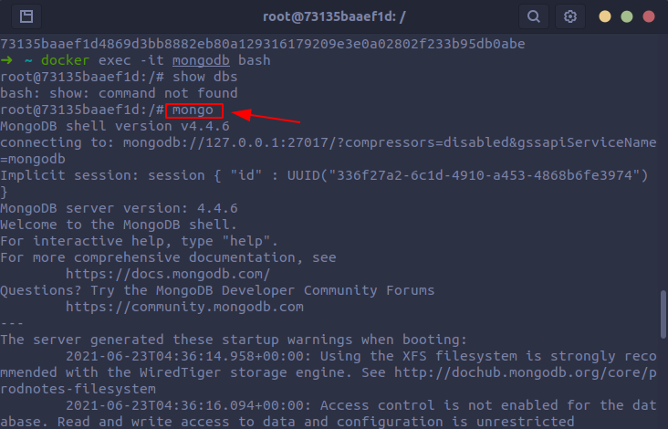
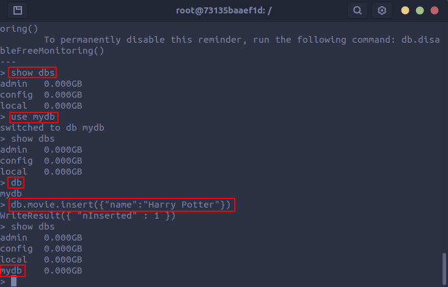
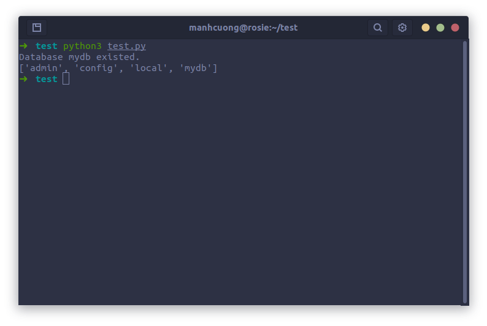

* Để có thể chạy **MongoDB** trong một container gồm các bước sau:
  * **Bước 1**: Pull image `mongo` về
    ```
    docker pull mongo
    ```
  * **Bước 2**: Tạo thư mục để lưu data
    ```
    cd ~
    mkdir mongodb
    ```
  * **Bước 3**: Tạo container
    ```
    docker run -it -v ~/mongodb:/data/db --name mongodb -d -p 27017:27017 mongo
    ```
  * **Bước 4**: Truy cập vào mongo bash
    ```
    docker exec -it mongodb bash
    ```
  * **Bước 5**: Vào CLI mongodb
    ```
    mongo
    ```
    
  * **Bước 6**: Tạo CSDL mới, lưu ý MongoDB yêu cầu có ít nhất một record nằm trong database thì database mới dc tạo chính thức
    

  * **Bước 7**: Kết nối với Python
    ```python
    # test.py
    import sys
    
    from pymongo import MongoClient
    
    def main():
        client = MongoClient('localhost', 27017)
        lst_databases = client.list_database_names()
        database = "mydb"
    
        
        if database not in lst_databases: 
            mydb = client[database]
            print("database created")
        else:
            print(f"Database {database} existed.")
            

    if __name__ == '__main__':
        main()
    ```
    